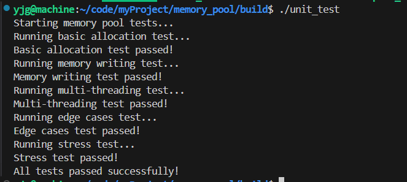
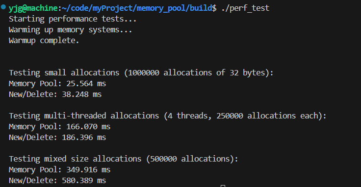

# memoryPool


## 项目介绍
本项目是基于 C++ 实现的自定义内存池框架，旨在提高内存分配和释放的效率，特别是在多线程环境下。
###  主要功能
- 线程本地缓存（ThreadCache）：每个线程维护自己的内存块链表，减少线程间的锁竞争，提高内存分配效率。
- 中心缓存（CentralCache）：用于管理多个线程共享的内存块，支持批量分配和回收，优化内存利用率。
- 页面缓存（PageCache）：负责从操作系统申请和释放大块内存，支持内存块的合并和分割，减少内存碎片。
- 自旋锁和原子操作：在多线程环境下使用自旋锁和原子操作，确保线程安全的同时减少锁的开销。

项目架构图如下：      


## 编译  
在项目目录下创建build目录，并进入该目录

执行 cmake 命令,执行 make 命令
```
cmake ..
make
make clean
```

## 运行
```
./可执行文件名
```  
## 测试结果

### 功能测试结果

### 性能测试结果
测试结果表明内存池v3的性能要略好于内存池v2。

